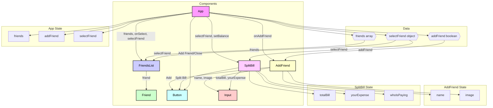

# Eat-n-Split App

```mermaid
graph TD
    subgraph "Components"
        A[App]
        B[FriendsList]
        C[Friend]
        D[AddFriend]
        E[SplitBill]
        F[Button]
        G[Input]
    end

    subgraph "Data"
        DS1{{friends array}}
        DS2{{addFriend boolean}}
        DS3{{selectFriend object}}
    end

    style A fill:#f9f,stroke:#333,stroke-width:2px,color:#000
    style B fill:#ccf,stroke:#333,stroke-width:2px,color:#000
    style C fill:#cfc,stroke:#333,stroke-width:2px,color:#000
    style D fill:#ffc,stroke:#333,stroke-width:2px,color:#000
    style E fill:#fcf,stroke:#333,stroke-width:2px,color:#000
    style F fill:#cff,stroke:#333,stroke-width:2px,color:#000
    style G fill:#fcc,stroke:#333,stroke-width:2px,color:#000

    A -- "friends, onSelect, selectFriend" --> B
    B -- "friend" --> C
    A -- "onAddFriend" --> D
    A -- "selectFriend, setBalance" --> E
    D -- "name, image" --> G
    E -- "totalBill, yourExpense" --> G
    D -- "Add" --> F
    E -- "Split Bill" --> F
    A -- "Add Friend/Close" --> F

    A --> DS1
    A --> DS2
    A --> DS3

    DS1 -- "friends" --> B
    DS2 -- "addFriend" --> D
    DS3 -- "selectFriend" --> E
    DS3 -- "selectFriend" --> B

    subgraph "App State"
        direction LR
        A_state1[friends]
        A_state2[addFriend]
        A_state3[selectFriend]
    end

    subgraph "AddFriend State"
        direction LR
        D_state1[name]
        D_state2[image]
    end

    subgraph "SplitBill State"
        direction LR
        E_state1[totalBill]
        E_state2[yourExpense]
        E_state3[whoIsPaying]
    end

    A --> A_state1
    A --> A_state2
    A --> A_state3
    D --> D_state1
    D --> D_state2
    E --> E_state1
    E --> E_state2
    E --> E_state3
```
