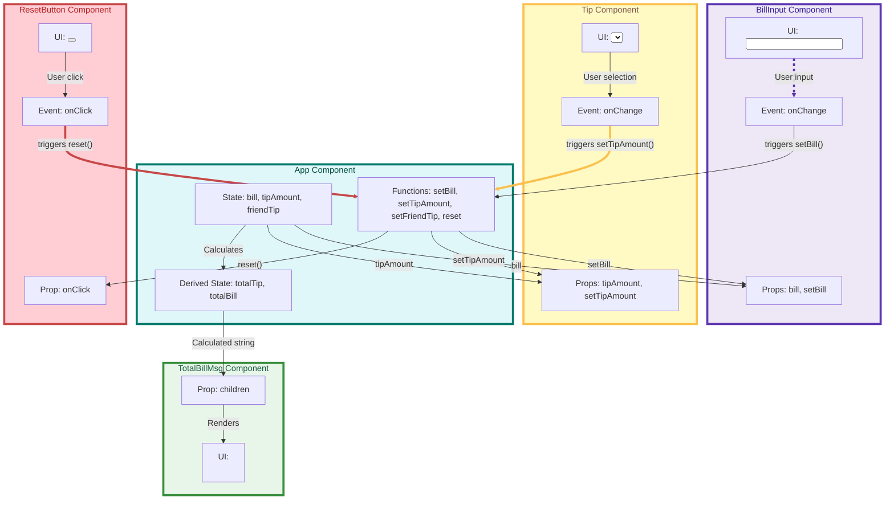

# DFD

```mermaid
graph TD
    %% Define the component subgraphs first
    subgraph App [App Component]
        A[State: bill, tipAmount, friendTip]
        B[Functions: setBill, setTipAmount, setFriendTip, reset]
        C[Derived State: totalTip, totalBill]
    end

    subgraph BillInput [BillInput Component]
        D[Props: bill, setBill]
        E[UI: <input>]
        F[Event: onChange]
    end

    subgraph Tip [Tip Component]
        G[Props: tipAmount, setTipAmount]
        H[UI: <select> Dropdown]
        I[Event: onChange]
    end

    subgraph TotalBillMsg [TotalBillMsg Component]
      J[Prop: children]
      K[UI: <h2>]
    end

    subgraph Reset [ResetButton Component]
        L[Prop: onClick]
        M[UI: <button>]
        N[Event: onClick]
    end

    %% Define the connections between nodes (Data Flow)
    %% App to Children (Props Down)
    A -- "bill" --> D
    B -- "setBill" --> D
    A -- "tipAmount" --> G
    B -- "setTipAmount" --> G
    C -- "Calculated string" --> J
    B -- "reset()" --> L

    %% Children to App (Events Up)
    E -- "User input" --> F
    F -- "triggers setBill()" --> B
    H -- "User selection" --> I
    I -- "triggers setTipAmount()" --> B
    M -- "User click" --> N
    N -- "triggers reset()" --> B

    %% App Internal Flow
    A -- "Calculates" --> C
    J -- "Renders" --> K

    %% --- STYLING SECTION ---
    style App fill:#e0f7fa,stroke:#00796b,stroke-width:4px,color:#004d40
    style BillInput fill:#ede7f6,stroke:#5e35b1,stroke-width:4px,color:#311b94
    style Tip fill:#fff9c4,stroke:#fbc04d,stroke-width:4px,color:#795548
    style TotalBillMsg fill:#e8f5e9,stroke:#388e3c,stroke-width:4px,color:#1b5e40
    style Reset fill:#ffcdd4,stroke:#c64848,stroke-width:4px,color:#b71c1c

    %% Style individual arrows (links)
    linkStyle 6 stroke:#5e35b1,stroke-width:4px,stroke-dasharray: 5 5
    linkStyle 9 stroke:#fbc04d,stroke-width:4px
    linkStyle 11 stroke:#c64848,stroke-width:4px
```
