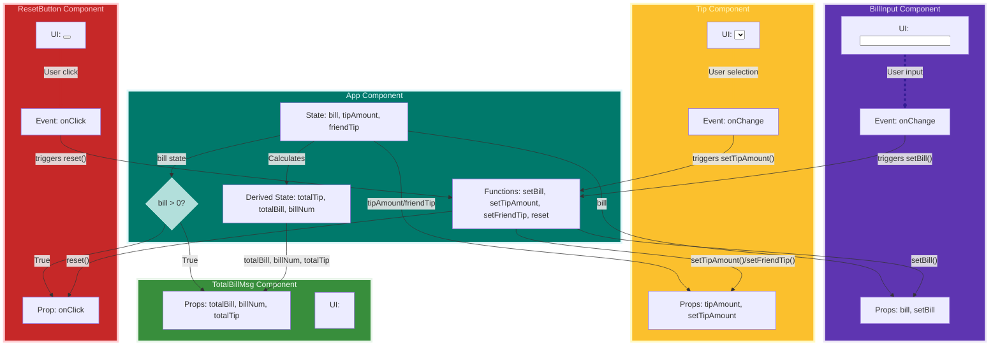

# DFD

```mermaid
graph TD
    %% Define the component subgraphs first
    subgraph App [App Component]
        A[State: bill, tipAmount, friendTip]
        B[Functions: setBill, setTipAmount, setFriendTip, reset]
        C[Derived State: totalTip, totalBill, billNum]
        COND{bill > 0?}
    end

    subgraph BillInput [BillInput Component]
        D[Props: bill, setBill]
        E[UI: <input>]
        F[Event: onChange]
    end

    subgraph Tip [Tip Component]
        G[Props: tipAmount, setTipAmount]
        H[UI: <select> Dropdown]
        I[Event: onChange]
    end

    subgraph TotalBillMsg [TotalBillMsg Component]
      J[Props: totalBill, billNum, totalTip]
      K[UI: <h2>]
    end

    subgraph Reset [ResetButton Component]
        L[Prop: onClick]
        M[UI: <button>]
        N[Event: onClick]
    end

    %% Define the connections between nodes (Data Flow)

    %% Internal App Flow
    A -- "Calculates" --> C
    A -- "bill state" --> COND

    %% Conditional Rendering Flow
    COND -- "True" --> J
    COND -- "True" --> L

    %% Data Down (Props)
    A -- "bill" --> D
    B -- "setBill()" --> D
    A -- "tipAmount/friendTip" --> G
    B -- "setTipAmount()/setFriendTip()" --> G
    C -- "totalBill, billNum, totalTip" --> J
    B -- "reset()" --> L

    %% Events Up (Callbacks)
    E -- "User input" --> F
    F -- "triggers setBill()" --> B
    H -- "User selection" --> I
    I -- "triggers setTipAmount()" --> B
    M -- "User click" --> N
    N -- "triggers reset()" --> B

    %% --- STYLING SECTION ---
    %% Style the subgraphs with background, border, and text colors
    style App fill:#00796b,stroke:#e0f7fa,stroke-width:4px,color:#e0f7fa
    style BillInput fill:#5e35b1,stroke:#ede7f6,stroke-width:4px,color:#ede7f6
    style Tip fill:#fbc02d,stroke:#fff9c4,stroke-width:4px,color:#fff9c4
    style TotalBillMsg fill:#388e3c,stroke:#e8f5e9,stroke-width:4px,color:#e8f5e9
    style Reset fill:#c62828,stroke:#ffcdd2,stroke-width:4px,color:#ffcdd2

    %% Style the conditional logic node
    style COND fill:#b2dfdb,stroke:#00796b

    %% Style key arrows
    linkStyle 10 stroke:#311b92,stroke-width:4px,stroke-dasharray: 5 5
    linkStyle 12 stroke:#fbc02d,stroke-width:4px
    linkStyle 14 stroke:#c62828,stroke-width:4px
```
